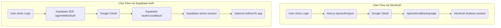

# 🔐 Google OAuth URI Configuration Comparison for Auth in Next.js + Supabase

This table compares **Google OAuth** configuration requirements (JS Origins and Redirect URIs) for the following auth solutions:
- **NextAuth.js v5**
- **NextAuth.js v4**
- **Supabase Authentication**

Each case is evaluated for local and cloud environments with Docker/local or remote Supabase DBs.

---

## 📊 Comparison Table

| Case | Auth Solution | Authorized JS Origins (Google Console) | Authorized Redirect URIs (Google Console) | Notes |
|------|---------------|-----------------------------------------|-------------------------------------------|-------|
| **(1)** Local Next.js + Local Docker Supabase DB | NextAuth v5 | `http://localhost:3000` | `http://localhost:3000/api/auth/callback/google` | NextAuth handles redirect on frontend. Callback to local server. |
|  | NextAuth v4 | `http://localhost:3000` | `http://localhost:3000/api/auth/callback/google` | Same as v5; manually configured in `next-auth`. |
|  | Supabase Auth | `http://localhost:3000` | `http://localhost:54321/auth/v1/callback` | Supabase handles OAuth; local docker port exposed. |
| **(2)** Local Next.js + Remote Supabase DB | NextAuth v5 | `http://localhost:3000` | `http://localhost:3000/api/auth/callback/google` | Same as (1) but Supabase is cloud-hosted. |
|  | NextAuth v4 | `http://localhost:3000` | `http://localhost:3000/api/auth/callback/google` | NextAuth only affects frontend redirect. |
|  | Supabase Auth | `http://localhost:3000` | `https://<project-ref>.supabase.co/auth/v1/callback` | Remote Supabase handles the OAuth callback. |
| **(3)** Vercel Next.js + Remote Supabase DB | NextAuth v5 | `https://your-app.vercel.app` `https://your-domain.com` | `https://your-app.vercel.app/api/auth/callback/google` `https://your-domain.com/api/auth/callback/google` | Must be exact domains. No wildcards in Google Console. |
|  | NextAuth v4 | `https://your-app.vercel.app` `https://your-domain.com` | `https://your-app.vercel.app/api/auth/callback/google` `https://your-domain.com/api/auth/callback/google` | Same callback URI pattern. |
|  | Supabase Auth | `https://your-app.vercel.app` `https://your-domain.com` | `https://<project-ref>.supabase.co/auth/v1/callback` | Only Supabase domain needs to be listed in Google. Frontend uses redirectTo in SDK. |

---

## 🔄 Mermaid Diagram: OAuth Flow by Method

### ✅ Key Clarification

When `Supabase handles the OAuth flow directly` (using supabase.auth.signInWithOAuth({ provider: 'google' })), the `Redirect URI is to Supabase itself`, not your Next.js frontend. You do not set api/auth/callback/google like with NextAuth.

### ✅ @supabase/ssr vs auth/supabase-adapter

| Aspect               | `@supabase/ssr`                                               | `auth/supabase-adapter` (for next-auth)                      |
|----------------------|--------------------------------------------------------------|--------------------------------------------------------------|
| Primary role         | Supabase client setup for SSR with secure cookie-based sessions and PKCE flow | Adapter to connect Supabase Auth backend with next-auth framework |
| Token storage        | Secure HTTP cookies accessible by server and client          | Managed by next-auth session storage (e.g., JWT, cookies)    |
| OAuth flow           | Uses PKCE flow by default (recommended for SSR)              | Uses next-auth’s OAuth flows, typically implicit or code flow|
| SSR support          | Built-in support for SSR frameworks (Next.js, SvelteKit)     | SSR support depends on next-auth’s implementation             |
| Session management   | Supabase-native session management with refresh tokens       | next-auth session management with Supabase as backend         |
| Use case            | Direct Supabase Auth integration in SSR apps                  | Using Supabase Auth with next-auth for broader auth features  |
| Complexity          | Requires configuring Supabase client and cookie handling     | Simplifies integration if already using next-auth             |

