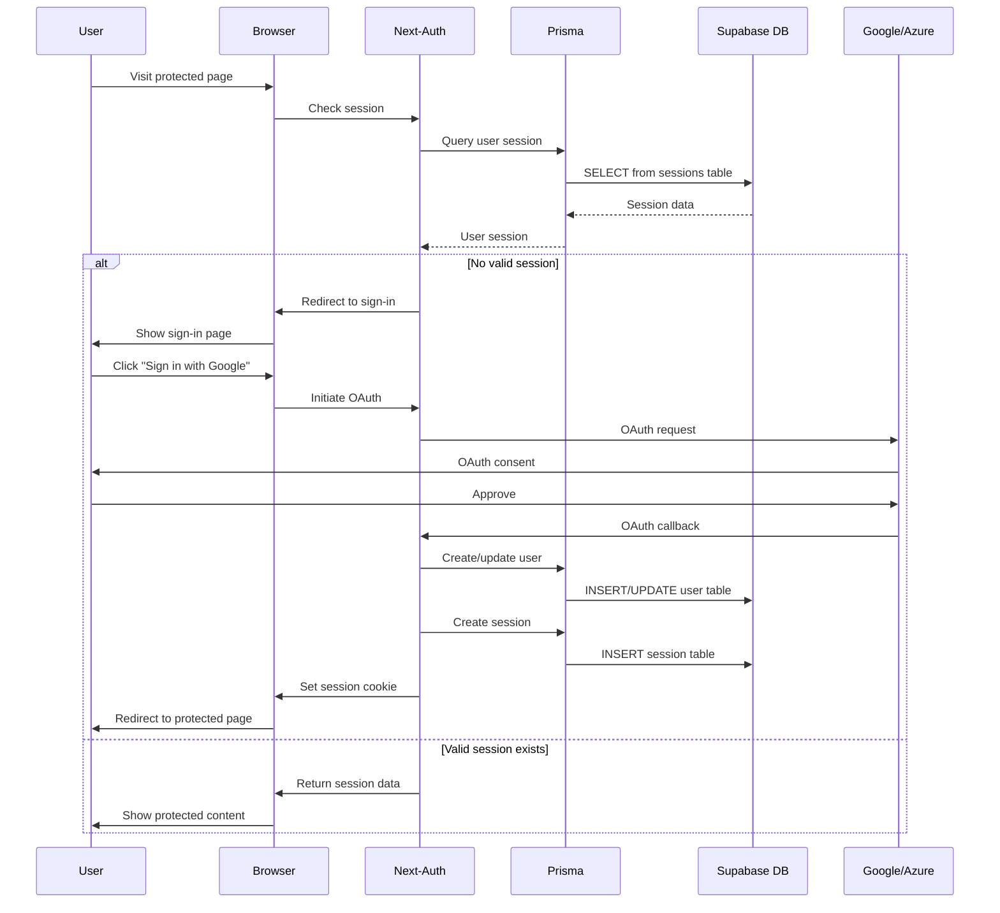

# Authentication Flow: Next-Auth v4 + Prisma + Supabase

## Authentication Architecture



## Database Schema for Authentication

### Next-Auth Required Tables

```sql
-- Users table (your existing User model works)
CREATE TABLE users (
    id TEXT PRIMARY KEY,
    account TEXT UNIQUE,
    name TEXT,
    email TEXT UNIQUE,
    password_hash TEXT,
    email_verified TIMESTAMPTZ,
    image TEXT,
    created_at TIMESTAMPTZ DEFAULT NOW(),
    updated_at TIMESTAMPTZ DEFAULT NOW()
);

-- Sessions table (required by Next-Auth)
CREATE TABLE sessions (
    id TEXT PRIMARY KEY,
    session_token TEXT UNIQUE NOT NULL,
    user_id TEXT NOT NULL REFERENCES users(id) ON DELETE CASCADE,
    expires TIMESTAMPTZ NOT NULL,
    created_at TIMESTAMPTZ DEFAULT NOW(),
    updated_at TIMESTAMPTZ DEFAULT NOW()
);

-- Accounts table (for OAuth providers)
CREATE TABLE accounts (
    id TEXT PRIMARY KEY,
    user_id TEXT NOT NULL REFERENCES users(id) ON DELETE CASCADE,
    type TEXT NOT NULL,
    provider TEXT NOT NULL,
    provider_account_id TEXT NOT NULL,
    refresh_token TEXT,
    access_token TEXT,
    expires_at INTEGER,
    token_type TEXT,
    scope TEXT,
    id_token TEXT,
    session_state TEXT,
    oauth_token_secret TEXT,
    oauth_token TEXT,
    created_at TIMESTAMPTZ DEFAULT NOW(),
    updated_at TIMESTAMPTZ DEFAULT NOW(),
    UNIQUE(provider, provider_account_id)
);

-- Verification tokens (for email verification)
CREATE TABLE verification_tokens (
    identifier TEXT NOT NULL,
    token TEXT NOT NULL,
    expires TIMESTAMPTZ NOT NULL,
    PRIMARY KEY (identifier, token)
);
```

## Prisma Schema Updates

Update your `prisma/schema.prisma`:

```prisma
model User {
  id            String    @id @default(cuid())
  account       String    @unique
  name          String?
  email         String?   @unique
  emailVerified DateTime? @map("email_verified")
  image         String?
  passwordHash  String?   @map("password_hash")
  lastLogin     DateTime? @map("last_login")
  lastLogout    DateTime? @map("last_logout")
  createdAt     DateTime  @default(now()) @map("created_at")
  updatedAt     DateTime  @updatedAt @map("updated_at")

  // Next-Auth relationships
  accounts      Account[]
  sessions      Session[]

  // Your existing relationships
  targetTemplates TargetTemplate[]
  faceSources     FaceSource[]
  generatedMedia  GeneratedMedia[]
  payments        Payment[]

  @@map("users")
}

model Account {
  id                String  @id @default(cuid())
  userId            String  @map("user_id")
  type              String
  provider          String
  providerAccountId String  @map("provider_account_id")
  refresh_token     String? @db.Text
  access_token      String? @db.Text
  expires_at        Int?
  token_type        String?
  scope             String?
  id_token          String? @db.Text
  session_state     String?
  oauth_token_secret String?
  oauth_token       String?
  createdAt         DateTime @default(now()) @map("created_at")
  updatedAt         DateTime @updatedAt @map("updated_at")

  user User @relation(fields: [userId], references: [id], onDelete: Cascade)

  @@unique([provider, providerAccountId])
  @@map("accounts")
}

model Session {
  id           String   @id @default(cuid())
  sessionToken String   @unique @map("session_token")
  userId       String   @map("user_id")
  expires      DateTime
  createdAt    DateTime @default(now()) @map("created_at")
  updatedAt    DateTime @updatedAt @map("updated_at")

  user User @relation(fields: [userId], references: [id], onDelete: Cascade)

  @@map("sessions")
}

model VerificationToken {
  identifier String
  token      String
  expires    DateTime

  @@unique([identifier, token])
  @@map("verification_tokens")
}
```

## Next-Auth Configuration

### Complete Auth Configuration (`src/services/auth.js`)

```javascript
import { PrismaAdapter } from '@next-auth/prisma-adapter'
import GoogleProvider from 'next-auth/providers/google'
import AzureADProvider from 'next-auth/providers/azure-ad'
import CredentialsProvider from 'next-auth/providers/credentials'
import { db } from '@/lib/db'
import bcrypt from 'bcryptjs'

export const authOptions = {
  // Use Prisma adapter for database integration
  adapter: PrismaAdapter(db),

  providers: [
    GoogleProvider({
      clientId: process.env.GOOGLE_CLIENT_ID,
      clientSecret: process.env.GOOGLE_CLIENT_SECRET,
    }),
    AzureADProvider({
      clientId: process.env.AZURE_AD_CLIENT_ID,
      clientSecret: process.env.AZURE_AD_CLIENT_SECRET,
      tenantId: process.env.AZURE_AD_TENANT_ID,
    }),
    CredentialsProvider({
      name: 'Email',
      credentials: {
        email: { label: 'Email', type: 'email' },
        password: { label: 'Password', type: 'password' },
      },
      async authorize(credentials) {
        if (!credentials?.email || !credentials?.password) {
          return null
        }

        try {
          const user = await db.user.findUnique({
            where: { account: credentials.email },
            select: {
              id: true,
              account: true,
              name: true,
              passwordHash: true,
            },
          })

          if (!user || !user.passwordHash) {
            return null
          }

          const isValidPassword = await bcrypt.compare(credentials.password, user.passwordHash)

          if (!isValidPassword) {
            return null
          }

          // Update last login
          await db.user.update({
            where: { id: user.id },
            data: { lastLogin: new Date() },
          })

          return {
            id: user.id,
            email: user.account,
            name: user.name || user.account.split('@')[0],
          }
        } catch (error) {
          console.error('Credentials auth error:', error)
          return null
        }
      },
    }),
  ],

  // Session configuration
  session: {
    strategy: 'jwt', // Use JWT for Vercel deployment
    maxAge: 30 * 24 * 60 * 60, // 30 days
  },

  // JWT configuration
  jwt: {
    maxAge: 30 * 24 * 60 * 60, // 30 days
  },

  // Callbacks
  callbacks: {
    async jwt({ token, user, account }) {
      // Persist the OAuth access_token to the token right after signin
      if (account) {
        token.accessToken = account.access_token
      }

      // Include user ID in token
      if (user) {
        token.userId = user.id
      }

      return token
    },

    async session({ session, token }) {
      // Send properties to the client
      if (token) {
        session.user.id = token.userId
        session.accessToken = token.accessToken
      }

      return session
    },

    async signIn({ user, account, profile }) {
      // Handle OAuth sign-ins
      if (account?.provider === 'google' || account?.provider === 'azure-ad') {
        try {
          // Check if user exists in your custom table
          const existingUser = await db.user.findUnique({
            where: { account: user.email },
          })

          if (!existingUser) {
            // Create user in your custom table
            await db.user.create({
              data: {
                id: user.id,
                account: user.email,
                name: user.name,
                lastLogin: new Date(),
              },
            })
          } else {
            // Update last login
            await db.user.update({
              where: { id: existingUser.id },
              data: { lastLogin: new Date() },
            })
          }
        } catch (error) {
          console.error('SignIn callback error:', error)
          return false
        }
      }

      return true
    },
  },

  // Pages
  pages: {
    signIn: '/auth/signin',
    error: '/auth/error',
  },

  // Events
  events: {
    async signOut({ token }) {
      if (token?.userId) {
        await db.user.update({
          where: { id: token.userId },
          data: { lastLogout: new Date() },
        })
      }
    },
  },

  // Debug mode for development
  debug: process.env.NODE_ENV === 'development',
}
```

## Environment Variables for Authentication

### Development (.env.local)

```bash
# NextAuth Configuration
NEXTAUTH_URL="http://localhost:3000"
NEXTAUTH_SECRET="development-secret-key"

# OAuth Providers
GOOGLE_CLIENT_ID="your-google-client-id"
GOOGLE_CLIENT_SECRET="your-google-client-secret"
AZURE_AD_CLIENT_ID="your-azure-client-id"
AZURE_AD_CLIENT_SECRET="your-azure-client-secret"
AZURE_AD_TENANT_ID="your-azure-tenant-id"
```

### Production (Vercel)

```bash
# NextAuth Configuration
NEXTAUTH_URL="https://your-app.vercel.app"
NEXTAUTH_SECRET="super-secure-production-secret"

# OAuth Providers (Production URLs)
GOOGLE_CLIENT_ID="production-google-client-id"
GOOGLE_CLIENT_SECRET="production-google-client-secret"
AZURE_AD_CLIENT_ID="production-azure-client-id"
AZURE_AD_CLIENT_SECRET="production-azure-client-secret"
AZURE_AD_TENANT_ID="your-azure-tenant-id"
```

## OAuth Provider Setup

### Google OAuth Setup

1. Go to [Google Cloud Console](https://console.cloud.google.com/)
2. Create a new project or select existing
3. Enable Google+ API
4. Create OAuth 2.0 credentials
5. Add authorized redirect URIs:
   - Development: `http://localhost:3000/api/auth/callback/google`
   - Production: `https://your-app.vercel.app/api/auth/callback/google`

### Azure AD Setup

1. Go to [Azure Portal](https://portal.azure.com/)
2. Navigate to Azure Active Directory
3. Go to App registrations → New registration
4. Add redirect URIs:
   - Development: `http://localhost:3000/api/auth/callback/azure-ad`
   - Production: `https://your-app.vercel.app/api/auth/callback/azure-ad`

## Authentication Utilities

### Server-side User Validation

```javascript
// src/utils/auth-helper.js
import { getServerSession } from 'next-auth'
import { authOptions } from '@/services/auth'
import { db } from '@/lib/db'

export async function getValidatedUserId() {
  try {
    const session = await getServerSession(authOptions)

    if (!session?.user?.id) {
      return null
    }

    // Verify user exists in database
    const user = await db.user.findUnique({
      where: { id: session.user.id },
      select: { id: true },
    })

    return user?.id || null
  } catch (error) {
    console.error('User validation error:', error)
    return null
  }
}

export async function requireAuth() {
  const userId = await getValidatedUserId()

  if (!userId) {
    throw new Error('Authentication required')
  }

  return userId
}
```

### Client-side Authentication Hook

```javascript
// src/hooks/useAuth.js
import { useSession } from 'next-auth/react'
import { useRouter } from 'next/navigation'
import { useEffect } from 'react'

export function useAuth(requireAuth = false) {
  const { data: session, status } = useSession()
  const router = useRouter()

  useEffect(() => {
    if (requireAuth && status === 'unauthenticated') {
      router.push('/auth/signin')
    }
  }, [status, requireAuth, router])

  return {
    user: session?.user,
    isLoading: status === 'loading',
    isAuthenticated: status === 'authenticated',
  }
}
```

## Testing Authentication

### Test Script

```javascript
// scripts/test-auth.js
import { db } from '../src/lib/db.js'

async function testAuth() {
  try {
    // Test database connection
    console.log('Testing database connection...')
    const userCount = await db.user.count()
    console.log(`✅ Found ${userCount} users in database`)

    // Test user creation
    console.log('Testing user creation...')
    const testUser = await db.user.create({
      data: {
        account: 'test@example.com',
        name: 'Test User',
      },
    })
    console.log(`✅ Created test user: ${testUser.id}`)

    // Clean up
    await db.user.delete({
      where: { id: testUser.id },
    })
    console.log('✅ Cleaned up test user')

    console.log('🎉 Authentication setup verified!')
  } catch (error) {
    console.error('❌ Authentication test failed:', error)
  } finally {
    await db.$disconnect()
  }
}

testAuth()
```

Run with: `node scripts/test-auth.js`

This comprehensive authentication setup ensures secure, scalable authentication across all deployment scenarios!
