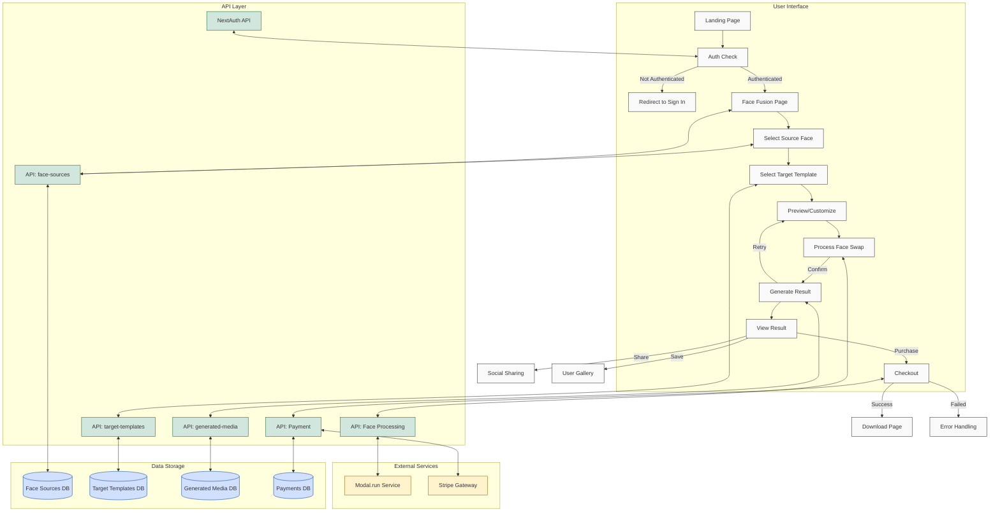

# Face Fusion Workflow

This document illustrates the workflow of the face-fusion feature, including user interactions, API calls, and data processing.

## Workflow Diagram

## Detailed Process Flow

1. **User Authentication Flow**

   - User lands on the application homepage
   - System checks authentication status via NextAuth
   - If not authenticated, redirect to sign-in page
   - After successful authentication, navigate to Face Fusion page

2. **Face Selection Process**

   - User selects or uploads a source face image
   - Application stores the face image in the database via `/api/face-sources` endpoint
   - User browses and selects a target template (video/image)
   - Templates are fetched from the database via `/api/target-templates` endpoint

3. **Processing Flow**

   - User can preview how the swap might look (if preview feature is available)
   - User customizes swap parameters (if customization is supported)
   - When ready, user initiates the face swap process
   - Application calls the Face Fusion Processing API (Modal.run service)
   - Processing status is displayed to the user

4. **Results and Checkout Flow**

   - Completed face swap result is stored in database via `/api/generated-media`
   - User views the result with options to retry, save, or purchase
   - If user chooses to purchase, checkout process is initiated
   - Application integrates with Stripe payment gateway
   - After successful payment, user can download or share the result

5. **Additional User Actions**
   - User can save favorites to their gallery
   - User can share results on social media
   - User can view their purchase history and saved items

## API Endpoints Structure

- `/api/auth/*` - Authentication endpoints (NextAuth)
- `/api/face-sources` - CRUD operations for user's face images
- `/api/target-templates` - List and retrieve available templates
- `/api/generated-media` - Store and retrieve generated face swap results
- `/api/payments` - Handle payment processing and records

## Database Models Interaction

The workflow utilizes several database models through Prisma:

- `User` - User authentication and profile information
- `FaceSource` - User's uploaded face images
- `TargetTemplate` - Available templates for face swapping
- `GeneratedMedia` - Results of face swap operations
- `Payment` - Record of user purchases

---

_Created: May 22, 2025_
